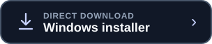

<p align="center">
  
</p>

<h1 align="center">DevSnapshot</h1>

<p align="center">
  <strong>Checkpoint your project before AI changes it.</strong><br>
  A private, offline Windows app for creating complete and verified ZIP snapshots of development projects.
</p>

<p align="center">
  <a href="../../actions/workflows/ci.yml"></a>
  <a href="LICENSE"></a>
  
  
</p>

<p align="center">
  <a href="https://apps.microsoft.com/detail/9PJC014G01TN?hl=en-us&amp;gl=IE&amp;ocid=pdpshare"></a>
  &nbsp;&nbsp;
  <a href="../../releases/latest/download/DevSnapshot-Setup.exe"></a>
</p>

<p align="center">
  <a href="../../releases/latest/download/DevSnapshot.exe">Portable version</a>
  &nbsp;&nbsp;·&nbsp;&nbsp;
  <a href="../../releases/latest">Release notes</a>
</p>

> Install from Microsoft Store for trusted delivery and automatic updates, or use the direct installer from the latest GitHub release. Both downloads contain the same private, offline DevSnapshot app.

## Why DevSnapshot?

Git protects committed history. DevSnapshot adds a quick local checkpoint containing
the rest of a working project too: untracked files, `.env` files, local databases,
IDE settings, dependencies, build output, and local Git metadata.

Use it before an AI coding session, large refactor, dependency upgrade, migration,
or any other change that may touch many files. DevSnapshot complements Git; it does
not replace it.

## Quick start

1. Install DevSnapshot from Microsoft Store, or choose the direct Windows installer above.
2. Run `DevSnapshot-Setup.exe`. Installation is per-user and needs no administrator permission.
3. Choose a project folder and backup location.
4. Select **Create Snapshot**.

The installer adds DevSnapshot to Windows Search, the Start Menu, the desktop, and
Apps > Installed apps. The portable download can be run without installation.

## What you get

- Complete snapshots by default—nothing is silently excluded
- Optional Custom mode when you intentionally want to skip selected folders
- `.env`, hidden files, `.gitignore`, and local Git history included by default
- Integrity verification before a snapshot is reported as successful
- Streaming ZIP creation without loading the whole project into memory
- Progress reporting, safe cancellation, and partial-file cleanup
- Collision-safe archive names and recent-snapshot history
- Automatic protection against archiving the backup folder into itself
- Graceful warnings for locked, missing, or inaccessible files
- No symlink traversal and no modification of project files

## Complete or Custom

| Mode | Best for | Behavior |
| --- | --- | --- |
| **Complete — recommended** | A faithful safety checkpoint | Includes every available file and folder |
| **Custom** | Smaller, intentional archives | Skips only the folders and special files you select |

A one-part custom rule such as `node_modules` matches a folder with that name at
any depth. A project-relative rule such as `dataset/raw` matches only that path and
its descendants. Glob patterns are intentionally not interpreted.

## Private by design

DevSnapshot is local and offline. It has no account, cloud service, API, telemetry,
analytics, advertisements, update checker, or network code. Project files are read
only to create the selected local ZIP archive.

Configuration and rotating logs are kept under `%APPDATA%\DevSnapshot`. Logs may
include useful paths and errors, but never record source contents, `.env` contents,
passwords, or API keys. See [PRIVACY.md](PRIVACY.md) for the complete policy.

## Build from source

Requirements: Windows 10 or 11 and Python 3.10 or newer.

Clone this repository using GitHub's **Code** button, then run:

```powershell
cd DevSnapshot
py -3.12 -m venv .venv
.venv\Scripts\Activate.ps1
python -m pip install -r requirements.txt
python main.py
```

Run the tests:

```powershell
python -m unittest discover -s tests -v
```

Build the portable executable:

```powershell
.\build.bat
```

Build and smoke-test the executable and Windows installer:

```powershell
.\build_release.bat
```

Release artifacts are written to `dist\DevSnapshot.exe` and
`dist\installer\DevSnapshot-Setup-<version>.exe`.

## Microsoft Store

The repository includes a dedicated MSIX builder, package manifest template,
Store asset generator, listing copy, and certification notes. Partner Center assigns
the package identity after the product name is reserved. DevSnapshot's assigned
identity is embedded in the manifest so repeatable Store builds cannot mistype it.

See [store/README.md](store/README.md) for the Store publishing checklist.

## Publishing a release

GitHub Actions tests every push and pull request. A semantic-version tag builds the
Windows executable and installer, creates SHA-256 checksums, and publishes a GitHub
release containing both the versioned installer and the stable one-click download
name used by this README.

```powershell
git push -u origin main
git push origin v1.0.0
```

## Contributing

Issues and pull requests are welcome. Please read [CONTRIBUTING.md](CONTRIBUTING.md),
[SECURITY.md](SECURITY.md), and [CODE_OF_CONDUCT.md](CODE_OF_CONDUCT.md) first.

## License

DevSnapshot is open-source software released under the [MIT License](LICENSE).
